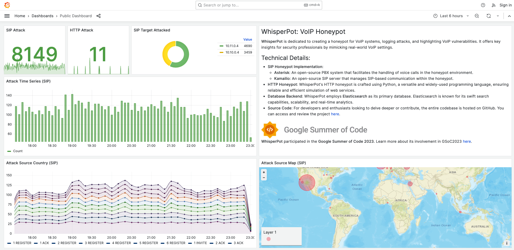
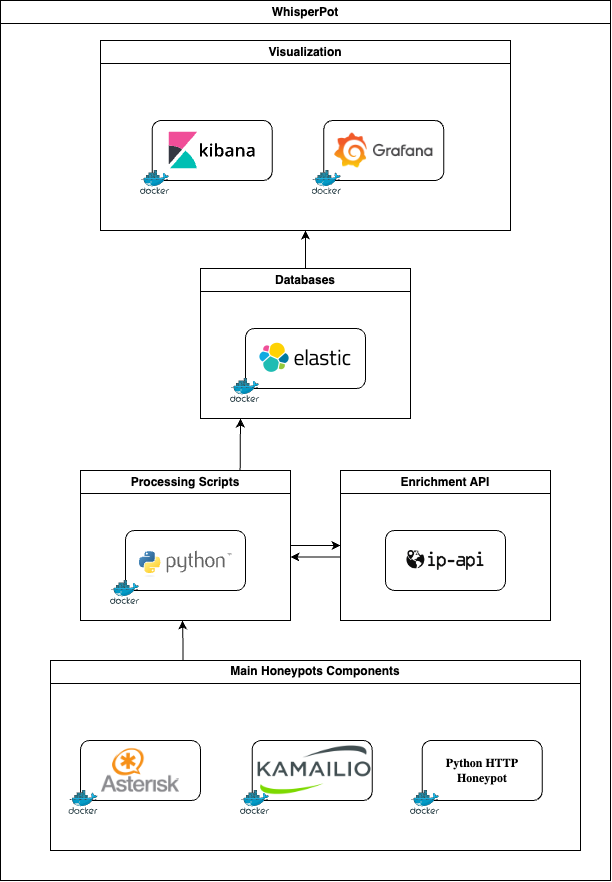
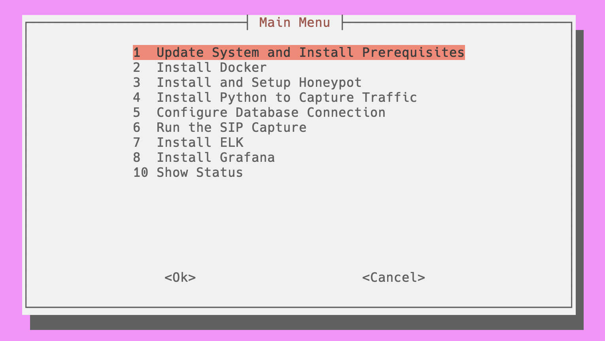

# WhisperPot

WhisperPot is an ongoing project aimed at creating a comprehensive VoIP honeypot system. It is designed to log attack attempts and identify 
potential threats and vulnerabilities in VoIP systems. WhisperPot simulates a realistic VoIP environment and is targeted at security 
researchers, VoIP service providers, and network administrators.

## Public Dashboard

Please check our [public dashboard here](https://whisperpot.xyz/).

<div align="center">
    
</div>

## Features

- SIP protocol support
- Multiple interaction modes (low-interaction and high-interaction)
- Customizable profiles for different VoIP systems, devices, usernames, and passwords
- Monitoring and logging capabilities for SIP messages, RTP traffic, and other relevant activities
- Ability to enrich with external data sources
- Integration with Elasticsearch for data storage and search
- Visualization using Kibana and Grafana

## Technical Implementation

WhisperPot leverages open-source technologies like Asterisk, an open-source PBX, and Kamailio, an open-source SIP server. The scripts are 
primarily built using Python and deployed on Linux-based operating systems.

## Architecture

<div align="center">
    
</div>

## Installation

1. **Clone the Repository**

```
git clone https://github.com/honeynet/whisperpot
```

Navigate to the cloned directory:

```
cd whisperpot
```

2. **Make Script as Executable**

```
sudo chmod +x setup_gui.sh
```

3. **Run the Executable Script**

You need to run it as sudo:

```
sudo ./ setup_gui.sh
```

<div align="center">
    
</div>

## GSoC 2023

The project was actively developed with participation in Google Summer of Code 2023. More information about WhisperPot in GSoC2023 
[here](https://summerofcode.withgoogle.com/archive/2023/projects/nCpKaIhz)

<div align="center">
    
</div>


## References

- [Who’s Calling?](https://www.usenix.org/system/files/sec20-prasad.pdf)
- [Using chatbots against voice spam](https://www.usenix.org/system/files/conference/soups2017/soups2017-sahin.pdf)
- [Artemisa: An open-source honeypot back-end to support security in VoIP domains](https://ieeexplore.ieee.org/document/5990712)
- [SentryPeer](https://sentrypeer.org/)
- [Brekeke SIP Server Honeypot](https://docs.brekeke.com/sip/honeypot)
- [The VoIP PBX Honeypot Advance Persistent Threat Analysis](https://www.scitepress.org/Papers/2021/104435/104435.pdf)
- [Dionaea SIP](https://dionaea.readthedocs.io/en/latest/service/sip.html)
